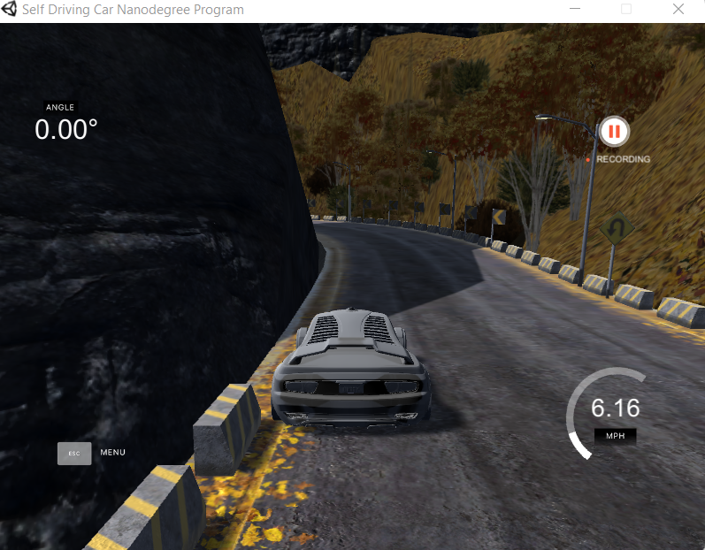
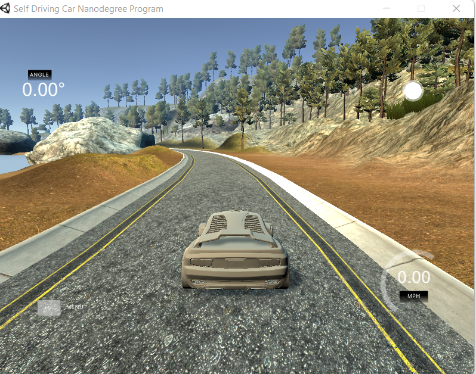
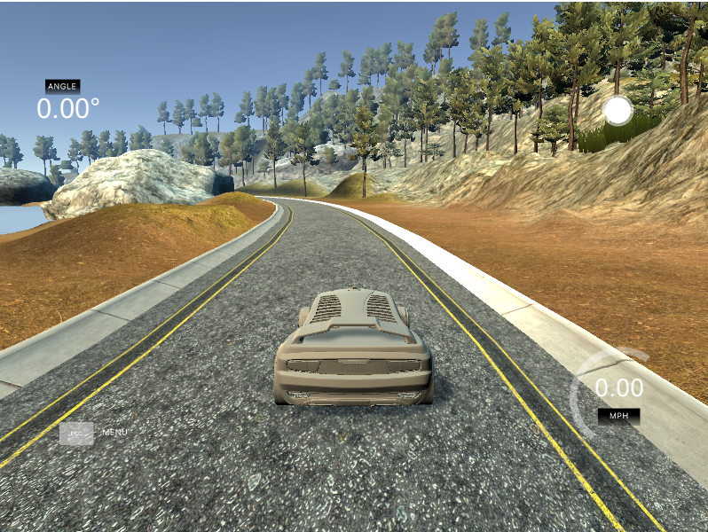

   

# Self-Driving Car Behavioral Cloning

## Overview

This is a full self-driving car behavioral cloning using End-to-End Learning approach and Computer Vision in [Udacity Self-Driving Car simulator](https://github.com/udacity/self-driving-car-sim).

This project is a tiny implementation of NVIDIA End-to-End self-driving cars paper [[1]](#references)

## End-to-End Architecture - NVIDIA


The system relies on a single Convolutional Neural Network (CNN) which takes visual data from cameras as input, and computes the steering command to drive the car.


## Requirements & Environment Setup

**Dependency installation**

```sh
pip install -r requirements.txt
```

**Udacity Self-Driving Car simulator**

The simulator communicates with the control/drive module bidirectionally, using a client-server architecture. The simulator is the server, and the control/drive module is the client.

Please refer to the official installation [repo](https://github.com/udacity/self-driving-car-sim) for guidelines.


**Data collection & training**

Start the udacity self-driving car Simulator


We have two modes: 
1. **Training Mode**: generates raw datas based on the driving examples and scenarios to fit the model



2. **Autonomous Mode**: we use the model to drive the car autonomously



You can also choose the type of track the car will be driving on: `flat` or `rougher`

**Dataset Format**

After collecting the training data the simulator generates an `IMG` folder containing the images of the driving scene/environment and a `driving_log.csv` file mapped in the following form:

|center camera img|left camera img|right camera img|steering|throttle|break|speed|
|--|--|--|--|--|--|--|
|center_img_frame1.jpg|left_img_frame1.jpg|right_img_frame1.jpg|0|0|0|0|
|...|...|...|...|...|...|...|
|center_img_frame_n.jpg|left_img_frame_n.jpg|right_img_frame_n.jpg|NA|NA|NA|NA|

This is because the car has 3 cameras: front left, front right and windshield camera

## Application

Behavioral cloning is a type of imitation learning and offers many benefits when it comes to develop autonomous systems: 

- learn directly from human demonstrations based on large amount real world collected data
- replay logging datas for debugging 
- test unsual driving scenarios, system limitations
- training large amounts of unlabeled data


## Usage 

- Start the simulator in `autonomous mode` 
- To run the app as follow:

```sh
python main.py
```

Notice: the training data was mainly collected in `flat track` mode, there still some improvement to be done to increase the model accuracy.

## Expected Results



At the start the streering angle and throttle control commands are set to zero. After the communication with server is established the self-driving car increase its speed gradually.


## Contributing 

If you want to help this project grow, feel free to submmit a PR or open an issue in case you encounter a problem running the project.

`Future upgrades`
```
- collect data in the rougher track
- increase model accuracy for rougher tracks
- add logger module
``` 


## References

- [1] [End to End Learning for Self-Driving Cars 2016 paper - NVIDIA]([gssgdqsg](https://images.nvidia.com/content/tegra/automotive/images/2016/solutions/pdf/end-to-end-dl-using-px.pdf))
- [2] [End-to-End Deep Learning for Self-Driving Cars - paper presentation - Blog article](https://developer.nvidia.com/blog/deep-learning-self-driving-cars/)
- [3] [Exploring the Limitations of Behavior Cloning for Autonomous Driving - CVF - Toyota Research Institute  - ICCV 2019](https://openaccess.thecvf.com/content_ICCV_2019/papers/Codevilla_Exploring_the_Limitations_of_Behavior_Cloning_for_Autonomous_Driving_ICCV_2019_paper.pdf)

> "As soon as it works, no one calls it AI anymore." 
>
> — John McCarthy (AI effect)


